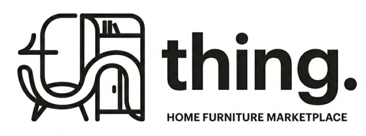
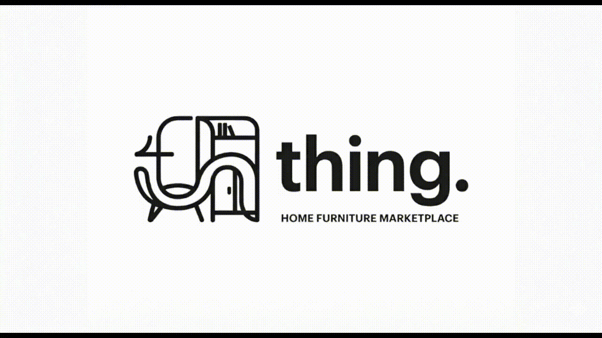
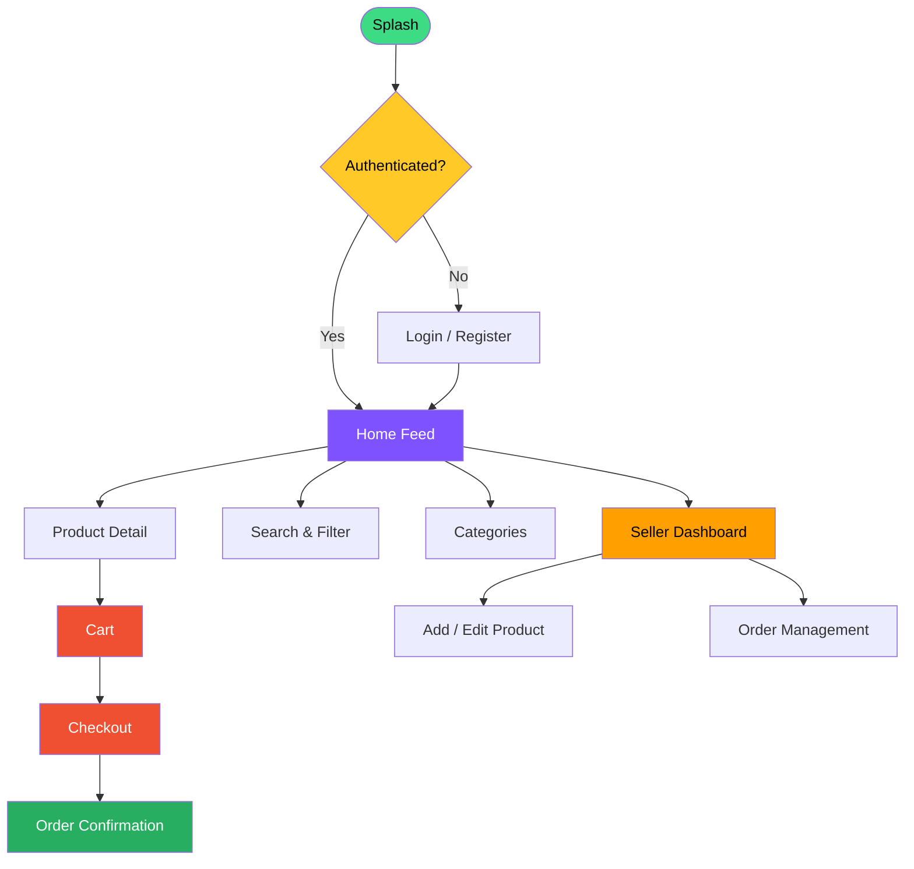
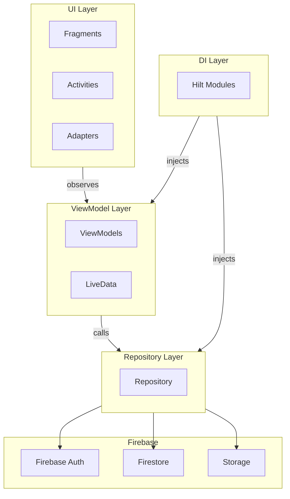

  

<h1>thing.</h1>

  <strong>thing</strong> is a mobile e-commerce application designed for buying and selling
  high-quality furniture products such as cupboards, chairs, tables, and other home furniture items.

  The application connects customers who are looking for modern and quality furniture
  with merchants who want to expand their market and offer their products online.

  <strong>thing</strong> provides a simple, clean, and user-friendly shopping experience
  while enabling sellers to manage their products and orders efficiently.

<table>
<tr>
<td align="center" width="900" style="padding:22px 40px; border:1px solid #e5e5e5; border-radius:12px;">

 

  

 

<h2 style="letter-spacing:2px; font-weight:600; color:#444;">
OUR PHILOSOPHY
</h2>

 

<h3>
<em>
"Furniture may be just a <strong>thing</strong> — but it's <strong>the thing.</strong> that turns a house into a home."
</em>
</h3>

 

</td>
</tr>
</table>

 

 

---

## Team Details

| &nbsp; | Name | Student ID | GitHub |
|:------:|:-----|:----------:|:-------|
|  | **Samed Tevin** | 230513327 |   |
|  | **Hasan Açıkel** | 220513343 |   |
|  | **Doğukan Süme** | 210513243 |   |
|  | **Kağan Şahin** | 220513375 |   |

---

## Project Introduction

**thing.** is an Android mobile application built with Kotlin and Firebase that serves as a marketplace for home furniture. It addresses the gap between quality furniture sellers and buyers by providing a seamless platform where:

- **Buyers** can browse, search, filter, and purchase furniture with a clean and intuitive UI.
- **Sellers** can list, manage, and track their products and orders through a dedicated dashboard.

The app follows the **MVVM** architecture pattern with Firebase as the backend (Authentication, Firestore, Storage), and uses Hilt for dependency injection and Kotlin Coroutines for async operations.

---

## Architecture Link

📐 Full architecture documentation: [ARCHITECTURE.md](./ARCHITECTURE.md)

---

  
<h2>Documents</h2>

| Document | File |
|:---------|:-----|
| 📋 Project Proposal | [SWE332_Project_Proposal.pdf](./ProjectManagement/Documents/SWE332_Project_Proposal.pdf) |
| 👤 Persona File | [thingPersonaFile.pdf](./ProjectManagement/Documents/thingPersonaFile.pdf) |

---

## Navigation Flow

---

  
<h2>Architecture Overview</h2>

**thing.** follows **MVVM (Model-View-ViewModel)** for clean separation of concerns and testability.

---

# Sprints

  

---

  
<h1>Sprint 1</h1>

---

    
<h2>App Screenshots</h2>

Coming Soon.

New features and updated screens will be added in this section.

---

  
<h2>Project Management</h2>

Coming Soon.

Sprint board visuals and task distribution details will be shared here.

---

  
<h2>Burndown Chart</h2>

Coming Soon.

Sprint burndown and performance charts will be available here.

---

- **Sprint Notes:**
  * To be updated.

- **Expected point completion within Sprint:**
  * `TBA`

- **Point Completion Logic:**
  * Details will be updated at the end of the sprint.

- **Sprint Review:**
  * To be updated.

- **Sprint Review Participants:**
  * `TBA`

- **Sprint Retrospective:**
  * To be updated.

---

  
<h1>Sprint 2</h1>

---

    
<h2>App Screenshots</h2>

Coming Soon.

---

  
<h2>Project Management</h2>

Coming Soon.

---

  
<h2>Burndown Chart</h2>

Coming Soon.

---

- **Sprint Notes:** To be updated.
- **Expected point completion within Sprint:** `TBA`
- **Point Completion Logic:** Details will be updated at the end of the sprint.
- **Sprint Review:** To be updated.
- **Sprint Review Participants:** `TBA`
- **Sprint Retrospective:** To be updated.

---

  
<h1>Sprint 3</h1>

---

    
<h2>App Screenshots</h2>

Coming Soon.

---

  
<h2>Project Management</h2>

Coming Soon.

---

  
<h2>Burndown Chart</h2>

Coming Soon.

---

- **Sprint Notes:** To be updated.
- **Expected point completion within Sprint:** `TBA`
- **Point Completion Logic:** Details will be updated at the end of the sprint.
- **Sprint Review:** To be updated.
- **Sprint Review Participants:** `TBA`
- **Sprint Retrospective:** To be updated.

---

  
<h1>Sprint 4</h1>

---

    
<h2>App Screenshots</h2>

Coming Soon.

---

  
<h2>Project Management</h2>

Coming Soon.

---

  
<h2>Burndown Chart</h2>

Coming Soon.

---

- **Sprint Notes:** To be updated.
- **Expected point completion within Sprint:** `TBA`
- **Point Completion Logic:** Details will be updated at the end of the sprint.
- **Sprint Review:** To be updated.
- **Sprint Review Participants:** `TBA`
- **Sprint Retrospective:** To be updated.

---

# Endnotes

 

---

## thing. Promo

### Video

<em>Coming Soon.</em>

---

  
<h2>Tech Stack</h2>

### Libraries & Technologies

| Category | Technologies |
|----------|-------------|
| Language |  |
| Architecture |    |
| Backend |    |
| Concurrency |  |
| Dependency Injection |  |
| UI |   |
| Design |  |
| Tools |  |
| Version Control |   |
| Project Management |  |

---

  
<h2>Design</h2>

### Font

| Weight | File |
|--------|------|
| Bold | `inter_18pt_bold.ttf` |
| SemiBold | `inter_18pt_semibold.ttf` |
| Medium | `inter_18pt_medium.ttf` |
| Regular | `inter_18pt_regular.ttf` |

### Colors

| Name | Hex | Preview |
|------|-----|---------|
| Black | `#171717` |  |
| White | `#F5F8FA` |  |
| Blue | `#000DAE` |  |
| Dark Blue | `#000759` |  |
| Blue Gray | `#97AABD` |  |
| Blue 100 | `#B8D9FA` |  |
| Gray 500 | `#969899` |  |
| Gray 700 | `#666666` |  |
| Light Red | `#FF9999` |  |
| Red | `#FF0000` |  |
| Orange Yellow | `#F8BA00` |  |
| Card Background | `#FAFDFF` |  |
| Line | `#E9EAEC` |  |

---
